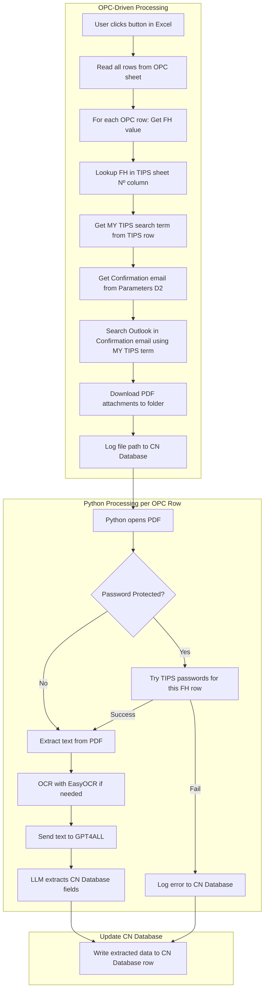
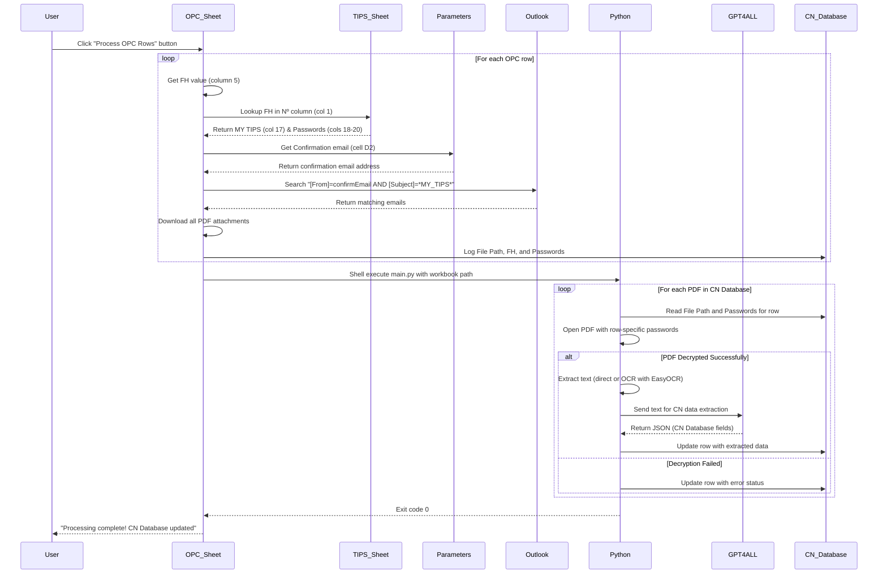

# Confirmation Note (CN) Extraction Pipeline - OPC_TEST (VBA + Python Hybrid)

## Architecture Overview



---

## Project Structure

```
project-worker/
├── OPC_TEST.xlsm           # Excel workbook with VBA macros
│   ├── Parameters          # INPUT: Confirmation email (D2), paths config
│   ├── OPC                 # INPUT: FH values (column 5) drive the workflow
│   ├── CN Database         # OUTPUT: 14 columns with extracted CN transaction data
│   └── TIPS                # LOOKUP: Nº, MY TIPS (col 17), Passwords (cols 18-20)
├── main.py                 # Python entry: reads CN Database, processes PDFs, updates rows
├── config.py               # Configuration (extraction prompt)
├── pdf_processor.py        # PDF decryption and rasterization
├── ocr_reader.py           # EasyOCR text extraction
├── data_extractor.py       # GPT4ALL CN field extraction
├── requirements.txt        # Python dependencies
└── downloads/              # PDFs saved by VBA (auto-created)
```

---

## Module Design

### 1. VBA Module (in `OPC_TEST.xlsm`)

Add this code to a new VBA module in Excel:

```vba
Option Explicit

' ====================================================================================
' OPC_TEST Email & PDF Extraction Module
' 
' Parameters Sheet Configuration (Column A = Name, Column B = Value):
'   - OPC folder: Path to the OPC folder/directory
'   - Personal email: Personal email address
'   - Hedge email: Hedge email address
'   - Confirmation email: Confirmation email address
'   - DOWNLOAD_FOLDER: Path to downloads folder
'   - PYTHON_PATH: Path to Python executable
'   - SCRIPT_PATH: Path to main.py script
' 
' OPC Sheet Configuration (Output Data):
'   - Columns: Alt Ref | OWNER | OLD COMMENTS | NEW COMMENTS | FH
' 
' CN Database Sheet Configuration:
'   - Columns: ID | File Path | Is it a CN? | Operation Type | Is it a Multiseries? | 
'             Currency | Gross Amount | Net Amount | Units | Equalization | Fees | 
'             NAV price | NAV date | Settlement Date
' 
' TIPS Sheet Configuration (20 columns):
'   - Nº | FUND HOUSE | DAY | TIME | CHANGED TO TRADITIONAL | CONNECTIVITY | 
'   - TOLERANCE | EXCEPTO TOLERANCIA | MAIL EMAIL ADRESS | ADDITIONAL EMAIL ADRESS | 
'   - TIPS | COMMENTS | QUERY EMAIL 1 | QUERY EMAIL 2 | QUERY EMAIL 3 | 
'   - PORTAL LINK | MY TIPS | DOCUMENT PASSWORD 1 | DOCUMENT PASSWORD 2 | DOCUMENT PASSWORD 3
' ====================================================================================

Sub ProcessOPCRows()
    ' Main entry point - OPC-driven workflow
    ' For each row in OPC sheet:
    '   1. Get FH value
    '   2. Lookup FH in TIPS Nº column
    '   3. Get MY TIPS search term
    '   4. Search Outlook in Confirmation email
    '   5. Download PDFs
    
    Application.StatusBar = "Processing OPC rows..."
    
    Dim wsOPC As Worksheet
    Dim wsCN As Worksheet
    Dim lastRow As Long
    Dim i As Long
    Dim fhValue As String
    Dim processedCount As Long
    
    ' Get OPC sheet
    On Error Resume Next
    Set wsOPC = ThisWorkbook.Sheets("OPC")
    On Error GoTo 0
    
    If wsOPC Is Nothing Then
        MsgBox "OPC sheet not found!", vbExclamation
        Exit Sub
    End If
    
    ' Setup CN Database sheet
    Call SetupCNDatabase
    Set wsCN = ThisWorkbook.Sheets("CN Database")
    
    ' Get last row in OPC sheet (FH is column 5)
    lastRow = wsOPC.Cells(wsOPC.Rows.Count, 5).End(xlUp).Row
    
    If lastRow < 2 Then
        MsgBox "No data in OPC sheet!", vbInformation
        Exit Sub
    End If
    
    processedCount = 0
    
    ' Loop through each OPC row
    For i = 2 To lastRow
        fhValue = Trim(wsOPC.Cells(i, 5).Value)  ' Column 5 = FH
        
        If fhValue <> "" Then
            Application.StatusBar = "Processing OPC row " & i & " (FH: " & fhValue & ")..."
            
            ' Process this FH value
            If ProcessSingleFH(fhValue, i, wsCN) Then
                processedCount = processedCount + 1
            End If
        End If
    Next i
    
    If processedCount > 0 Then
        Application.StatusBar = "Processing " & processedCount & " PDFs with Python..."
        RunPythonScript
        MsgBox "Processed " & processedCount & " OPC rows successfully!", vbInformation
    Else
        MsgBox "No PDFs downloaded from OPC rows.", vbInformation
    End If
    
    Application.StatusBar = False
End Sub

Function GetParameterValue(paramName As String) As String
    ' Read parameter from Parameters sheet (Column A = name, Column B = value)
    Dim wsParams As Worksheet
    Dim lastRow As Long
    Dim i As Long
    
    On Error Resume Next
    Set wsParams = ThisWorkbook.Sheets("Parameters")
    On Error GoTo 0
    
    If wsParams Is Nothing Then
        GetParameterValue = ""
        Exit Function
    End If
    
    lastRow = wsParams.Cells(wsParams.Rows.Count, 1).End(xlUp).Row
    For i = 1 To lastRow
        If wsParams.Cells(i, 1).Value = paramName Then
            GetParameterValue = wsParams.Cells(i, 2).Value
            Exit Function
        End If
    Next i
    
    GetParameterValue = ""
End Function

Function GetConfirmationEmail() As String
    ' Get Confirmation email from Parameters sheet cell D2
    Dim wsParams As Worksheet
    
    On Error Resume Next
    Set wsParams = ThisWorkbook.Sheets("Parameters")
    On Error GoTo 0
    
    If wsParams Is Nothing Then
        GetConfirmationEmail = ""
    Else
        GetConfirmationEmail = Trim(wsParams.Range("D2").Value)
    End If
End Function

Function GetTIPSInfoByNumber(fhNumber As String) As Dictionary
    ' Lookup FH number in TIPS Nº column and return row data
    ' Returns Dictionary with: MY_TIPS, PASSWORD1, PASSWORD2, PASSWORD3
    Dim wsTips As Worksheet
    Dim dict As Object
    Dim lastRow As Long
    Dim i As Long
    
    Set dict = CreateObject("Scripting.Dictionary")
    
    On Error Resume Next
    Set wsTips = ThisWorkbook.Sheets("TIPS")
    On Error GoTo 0
    
    If wsTips Is Nothing Then
        Set GetTIPSInfoByNumber = dict
        Exit Function
    End If
    
    ' Column 1 = Nº
    lastRow = wsTips.Cells(wsTips.Rows.Count, 1).End(xlUp).Row
    
    For i = 2 To lastRow
        If Trim(CStr(wsTips.Cells(i, 1).Value)) = fhNumber Then
            ' Found the row
            dict("MY_TIPS") = Trim(wsTips.Cells(i, 17).Value)  ' Column 17 = MY TIPS
            dict("PASSWORD1") = Trim(wsTips.Cells(i, 18).Value)  ' Column 18 = DOCUMENT PASSWORD 1
            dict("PASSWORD2") = Trim(wsTips.Cells(i, 19).Value)  ' Column 19 = DOCUMENT PASSWORD 2
            dict("PASSWORD3") = Trim(wsTips.Cells(i, 20).Value)  ' Column 20 = DOCUMENT PASSWORD 3
            dict("FUND_HOUSE") = Trim(wsTips.Cells(i, 2).Value)  ' Column 2 = FUND HOUSE
            Set GetTIPSInfoByNumber = dict
            Exit Function
        End If
    Next i
    
    ' Not found
    Set GetTIPSInfoByNumber = dict
End Function

Function ProcessSingleFH(fhNumber As String, opcRow As Long, wsCN As Worksheet) As Boolean
    ' Process a single FH number from OPC sheet
    ' 1. Lookup FH in TIPS
    ' 2. Get MY TIPS search term
    ' 3. Get Confirmation email from Parameters
    ' 4. Search Outlook and download PDFs
    ' 5. Log to CN Database
    
    On Error GoTo ErrorHandler
    
    Dim tipsInfo As Object
    Dim confirmEmail As String
    Dim searchTerm As String
    Dim downloadFolder As String
    Dim olApp As Object
    Dim olNs As Object
    Dim olFolder As Object
    Dim olItems As Object
    Dim olMail As Object
    Dim olAttach As Object
    Dim pdfDownloaded As Boolean
    Dim cnRow As Long
    
    ProcessSingleFH = False
    pdfDownloaded = False
    
    ' Get TIPS info for this FH number
    Set tipsInfo = GetTIPSInfoByNumber(fhNumber)
    
    If tipsInfo.Count = 0 Or tipsInfo("MY_TIPS") = "" Then
        Debug.Print "No TIPS info found for FH: " & fhNumber
        Exit Function
    End If
    
    searchTerm = tipsInfo("MY_TIPS")
    
    ' Get Confirmation email from Parameters D2
    confirmEmail = GetConfirmationEmail()
    If confirmEmail = "" Then
        MsgBox "Confirmation email not found in Parameters D2!", vbExclamation
        Exit Function
    End If
    
    ' Get download folder
    downloadFolder = GetParameterValue("DOWNLOAD_FOLDER")
    If downloadFolder = "" Then
        downloadFolder = ThisWorkbook.Path & "\downloads\"
    End If
    
    ' Create downloads folder if needed
    If Dir(downloadFolder, vbDirectory) = "" Then
        MkDir downloadFolder
    End If
    
    ' Connect to Outlook
    Set olApp = CreateObject("Outlook.Application")
    Set olNs = olApp.GetNamespace("MAPI")
    Set olFolder = olNs.GetDefaultFolder(6)  ' 6 = Inbox
    
    ' Search for emails from Confirmation email address with search term in subject
    Set olItems = olFolder.Items.Restrict("[From] = '" & confirmEmail & "' AND [Subject] = '*" & searchTerm & "*'")
    
    ' Loop through matching emails
    For Each olMail In olItems
        If TypeName(olMail) = "MailItem" Then
            ' Process PDF attachments
            For Each olAttach In olMail.Attachments
                If LCase(Right(olAttach.FileName, 4)) = ".pdf" Then
                    ' Save PDF to downloads folder
                    Dim savePath As String
                    savePath = downloadFolder & Format(Now, "yyyymmdd_hhnnss") & "_FH" & fhNumber & "_" & olAttach.FileName
                    olAttach.SaveAsFile savePath
                    
                    ' Log to CN Database
                    cnRow = wsCN.Cells(wsCN.Rows.Count, 1).End(xlUp).Row + 1
                    wsCN.Cells(cnRow, 1).Value = cnRow - 1  ' ID
                    wsCN.Cells(cnRow, 2).Value = savePath  ' File Path
                    ' Store metadata for Python processing
                    wsCN.Cells(cnRow, 15).Value = fhNumber  ' Temporary column for FH reference
                    wsCN.Cells(cnRow, 16).Value = tipsInfo("PASSWORD1")  ' Temp: Password 1
                    wsCN.Cells(cnRow, 17).Value = tipsInfo("PASSWORD2")  ' Temp: Password 2
                    wsCN.Cells(cnRow, 18).Value = tipsInfo("PASSWORD3")  ' Temp: Password 3
                    
                    pdfDownloaded = True
                End If
            Next olAttach
        End If
    Next olMail
    
    ProcessSingleFH = pdfDownloaded
    Exit Function
    
ErrorHandler:
    Debug.Print "Error processing FH " & fhNumber & ": " & Err.Description
    ProcessSingleFH = False
End Function

Sub SetupCNDatabase()
    ' Setup CN Database worksheet if it doesn't exist
    Dim wsCN As Worksheet
    
    On Error Resume Next
    Set wsCN = ThisWorkbook.Sheets("CN Database")
    On Error GoTo 0
    
    If wsCN Is Nothing Then
        Set wsCN = ThisWorkbook.Sheets.Add
        wsCN.Name = "CN Database"
        ' Create headers
        wsCN.Cells(1, 1).Value = "ID"
        wsCN.Cells(1, 2).Value = "File Path"
        wsCN.Cells(1, 3).Value = "Is it a CN?"
        wsCN.Cells(1, 4).Value = "Operation Type"
        wsCN.Cells(1, 5).Value = "Is it a Multiseries?"
        wsCN.Cells(1, 6).Value = "Currency"
        wsCN.Cells(1, 7).Value = "Gross Amount"
        wsCN.Cells(1, 8).Value = "Net Amount"
        wsCN.Cells(1, 9).Value = "Units"
        wsCN.Cells(1, 10).Value = "Equalization"
        wsCN.Cells(1, 11).Value = "Fees"
        wsCN.Cells(1, 12).Value = "NAV price"
        wsCN.Cells(1, 13).Value = "NAV date"
        wsCN.Cells(1, 14).Value = "Settlement Date"
    End If
End Sub

' NOTE: Old email-scanning functions removed - replaced by OPC-driven workflow
' New approach: ProcessOPCRows() → ProcessSingleFH() → GetTIPSInfoByNumber()

Sub RunPythonScript()
    ' Execute Python script and wait for completion
    ' Python will read CN Database rows and process PDFs with row-specific passwords
    Dim wsh As Object
    Dim cmd As String
    Dim result As Long
    Dim pythonPath As String
    Dim scriptPath As String
    
    ' Get paths from Parameters sheet
    pythonPath = GetParameterValue("PYTHON_PATH")
    If pythonPath = "" Then pythonPath = "python"
    
    scriptPath = GetParameterValue("SCRIPT_PATH")
    If scriptPath = "" Then scriptPath = ThisWorkbook.Path & "\main.py"
    
    Set wsh = CreateObject("WScript.Shell")
    
    ' Build command: Pass only the workbook path
    ' Python will read CN Database to get File Path and passwords for each row
    cmd = "cmd /c cd /d """ & ThisWorkbook.Path & """ && " & _
          pythonPath & " """ & scriptPath & """ """ & ThisWorkbook.FullName & """"
    
    ' Run and wait (0 = hidden window, True = wait)
    result = wsh.Run(cmd, 0, True)
    
    If result = 0 Then
        MsgBox "Processing complete! Check the CN Database sheet.", vbInformation
    Else
        MsgBox "Python script failed with exit code: " & result, vbExclamation
    End If
End Sub

' NOTE: RefreshOPCSheet and ExportPasswordsToFile removed - not needed in OPC-driven workflow
' OPC sheet is INPUT (not output), passwords are row-specific (not exported to file)
```

### 2. PDF Processor (`pdf_processor.py`)

Uses PyMuPDF (fitz) for decryption and rasterization:

```python
import fitz  # PyMuPDF
from pathlib import Path

def load_passwords(passwords_file: str) -> list[str]:
    """Load passwords from file, one per line."""
    path = Path(passwords_file)
    if not path.exists():
        return []
    return [line.strip() for line in path.read_text().splitlines() if line.strip()]

def try_open_pdf(pdf_path: str, passwords_list: list[str]) -> fitz.Document | None:
    """Attempt to open PDF, trying passwords if encrypted."""
    doc = fitz.open(pdf_path)
    if doc.is_encrypted:
        # Try empty password first
        if doc.authenticate(""):
            return doc
        for pwd in passwords_list:
            if doc.authenticate(pwd):
                return doc
        return None  # Failed to decrypt
    return doc

def rasterize_pages(doc: fitz.Document, dpi: int = 300) -> list[bytes]:
    """Convert PDF pages to PNG images for OCR."""
    images = []
    for page in doc:
        mat = fitz.Matrix(dpi / 72, dpi / 72)
        pix = page.get_pixmap(matrix=mat)
        images.append(pix.tobytes("png"))
    return images
```

### 3. OCR Reader (`ocr_reader.py`)

Uses EasyOCR for text extraction:

```python
import easyocr

# Initialize reader once (downloads model on first run)
_reader = None

def get_reader(languages: list[str] = ['en'], gpu: bool = True) -> easyocr.Reader:
    """Get or create EasyOCR reader instance."""
    global _reader
    if _reader is None:
        _reader = easyocr.Reader(languages, gpu=gpu)
    return _reader

def extract_text_from_images(images: list[bytes], languages: list[str] = ['en']) -> str:
    """Run OCR on rasterized PDF pages."""
    reader = get_reader(languages)
    full_text = []
    
    for img_bytes in images:
        # EasyOCR accepts bytes directly
        result = reader.readtext(img_bytes, detail=0)
        full_text.extend(result)
    
    return "\n".join(full_text)
```

### 4. Data Extractor (`data_extractor.py`)

Uses GPT4ALL for local LLM inference:

```python
import json
import re
from gpt4all import GPT4All

_model = None

def get_model(model_name: str = "Meta-Llama-3-8B-Instruct.Q4_0.gguf") -> GPT4All:
    """Get or create GPT4All model instance."""
    global _model
    if _model is None:
        _model = GPT4All(model_name)
    return _model

def extract_structured_data(text: str, extraction_prompt: str, model_name: str = None) -> dict:
    """Use LLM to extract specific fields from OCR text.
    
    Expected output fields (CN Database columns 3-14):
    - is_cn: Is this a Confirmation Note?
    - operation_type: Type of operation
    - is_multiseries: Is it a multiseries transaction?
    - currency: Transaction currency
    - gross_amount: Gross amount
    - net_amount: Net amount
    - units: Number of units
    - equalization: Equalization value
    - fees: Associated fees
    - nav_price: NAV price
    - nav_date: NAV date
    - settlement_date: Settlement date
    """
    model = get_model(model_name) if model_name else get_model()
    
    prompt = f"""{extraction_prompt}

Document text:
---
{text[:4000]}  # Limit context length
---

Respond with ONLY valid JSON, no other text:"""

    response = model.generate(prompt, max_tokens=500, temp=0.1)
    return parse_json_response(response)

def parse_json_response(response: str) -> dict:
    """Extract JSON from LLM response."""
    # Try to find JSON in response
    try:
        # Look for JSON object pattern
        match = re.search(r'\{[^{}]*\}', response, re.DOTALL)
        if match:
            return json.loads(match.group())
    except json.JSONDecodeError:
        pass
    
    return {"raw_response": response, "parse_error": True}
```

### 5. Main Orchestrator (`main.py`)

```python
import sys
from pathlib import Path
from datetime import datetime

from config import (PASSWORDS_FILE, OUTPUT_FILE, EXTRACTION_PROMPT, LLM_MODEL,
                   load_passwords_from_tips, read_parameter_from_excel)
from pdf_processor import try_open_pdf, rasterize_pages, load_passwords
from ocr_reader import extract_text_from_images
from data_extractor import extract_structured_data
from excel_writer import write_to_excel, write_to_opc_sheet, update_cn_database

def process_pdfs_from_cn_database(workbook_path: str) -> int:
    """Process PDFs based on CN Database rows (OPC-driven workflow).
    
    For each row in CN Database:
    1. Read File Path (col 2) and passwords (temp cols 16-18)
    2. Open PDF with row-specific passwords
    3. Extract text and send to LLM
    4. Update CN Database row with extracted data
    
    Returns: Number of successfully processed PDFs
    """
    if not workbook_path or not Path(workbook_path).exists():
        print("Error: Workbook path not provided or doesn't exist")
        return 0
    
    try:
        from openpyxl import load_workbook
        wb = load_workbook(workbook_path, keep_vba=True)
        
        if "CN Database" not in wb.sheetnames:
            print("Error: CN Database sheet not found")
            return 0
        
        ws = wb["CN Database"]
        processed_count = 0
        
        # Process each row (starting from row 2, assuming row 1 is headers)
        for row_num in range(2, ws.max_row + 1):
            file_path = ws.cell(row_num, 2).value  # Column 2 = File Path
            
            if not file_path or not Path(file_path).exists():
                print(f"Row {row_num}: File not found: {file_path}")
                continue
            
            # Get row-specific passwords from temp columns
            pwd1 = ws.cell(row_num, 16).value or ""  # Temp col 16
            pwd2 = ws.cell(row_num, 17).value or ""  # Temp col 17
            pwd3 = ws.cell(row_num, 18).value or ""  # Temp col 18
            passwords = [p for p in [pwd1, pwd2, pwd3] if p]
            
            print(f"\nProcessing row {row_num}: {Path(file_path).name}")
            
            try:
                # Open PDF with row-specific passwords
                doc = try_open_pdf(file_path, passwords)
                if doc is None:
                    print(f"  ERROR: Could not decrypt PDF")
                    ws.cell(row_num, 3).value = "ERROR: Password protected"
                    continue
                
                # Extract text (rasterize + OCR)
                print(f"  Rasterizing {len(doc)} pages...")
                images = rasterize_pages(doc)
                doc.close()
                
                print(f"  Running OCR...")
                text = extract_text_from_images(images)
                
                # Extract CN data with LLM
                print(f"  Extracting CN data with LLM...")
                data = extract_structured_data(text, EXTRACTION_PROMPT, LLM_MODEL)
                
                # Update CN Database row with extracted data
                ws.cell(row_num, 3).value = data.get("is_cn", "")
                ws.cell(row_num, 4).value = data.get("operation_type", "")
                ws.cell(row_num, 5).value = data.get("is_multiseries", "")
                ws.cell(row_num, 6).value = data.get("currency", "")
                ws.cell(row_num, 7).value = data.get("gross_amount", "")
                ws.cell(row_num, 8).value = data.get("net_amount", "")
                ws.cell(row_num, 9).value = data.get("units", "")
                ws.cell(row_num, 10).value = data.get("equalization", "")
                ws.cell(row_num, 11).value = data.get("fees", "")
                ws.cell(row_num, 12).value = data.get("nav_price", "")
                ws.cell(row_num, 13).value = data.get("nav_date", "")
                ws.cell(row_num, 14).value = data.get("settlement_date", "")
                
                # Clear temp password columns
                ws.cell(row_num, 16).value = None
                ws.cell(row_num, 17).value = None
                ws.cell(row_num, 18).value = None
                
                processed_count += 1
                print(f"  ✓ Successfully extracted CN data")
                
            except Exception as e:
                print(f"  ERROR: {e}")
                ws.cell(row_num, 3).value = f"ERROR: {str(e)}"
        
        # Save workbook
        wb.save(workbook_path)
        print(f"\n✓ Workbook saved. Processed {processed_count} PDFs successfully.")
        return processed_count
        
    except Exception as e:
        print(f"Fatal error processing CN Database: {e}")
        return 0

def main():
    """Main entry point for OPC-driven CN extraction workflow.
    
    Workflow:
    1. VBA reads OPC sheet rows
    2. For each FH value, VBA searches Outlook and downloads PDFs
    3. VBA logs File Path and passwords to CN Database
    4. Python processes each CN Database row with row-specific passwords
    5. Python updates CN Database with extracted CN data
    """
    # Get workbook path from command line
    workbook_path = None
    if len(sys.argv) > 1:
        workbook_path = sys.argv[1]
    else:
        workbook_path = Path(__file__).parent / "OPC_TEST.xlsm"
    
    if not workbook_path or not Path(workbook_path).exists():
        print(f"Error: OPC_TEST workbook not found: {workbook_path}")
        print("Usage: python main.py <path_to_OPC_TEST.xlsm>")
        return 1
    
    print(f"Using OPC_TEST workbook: {workbook_path}")
    print("Processing PDFs from CN Database...")
    
    # Process PDFs based on CN Database rows
    processed_count = process_pdfs_from_cn_database(workbook_path)
    
    if processed_count > 0:
        print(f"\n✓ Successfully processed {processed_count} PDFs!")
        print("CN Database has been updated with extracted data.")
        return 0
    else:
        print("\n⚠ No PDFs were processed successfully.")
        return 1

if __name__ == "__main__":
    sys.exit(main())
```

---

## Configuration (`config.py`)

```python
from pathlib import Path

# OCR settings
OCR_LANGUAGES = ['en']
PDF_DPI = 300

# GPT4ALL model (will download on first run if not present)
LLM_MODEL = "Meta-Llama-3-8B-Instruct.Q4_0.gguf"

# Extraction prompt - CUSTOMIZE THIS for your CN documents
# Output maps to CN Database columns (3-14)
EXTRACTION_PROMPT = """
Extract the following fields from this Confirmation Note (CN) document:

- Is it a CN?: Boolean - Is this a Confirmation Note? (Yes/No/True/False)
- Operation Type: Type of transaction operation (e.g., Purchase, Redemption, Switch, Subscription)
- Is it a Multiseries?: Boolean - Is this a multiseries transaction? (Yes/No/True/False)
- Currency: Transaction currency code (e.g., USD, EUR, GBP, CHF)
- Gross Amount: Gross transaction amount (numeric value)
- Net Amount: Net transaction amount (numeric value)
- Units: Number of units/shares (numeric value)
- Equalization: Equalization amount (numeric value)
- Fees: Total fees charged (numeric value)
- NAV price: Net Asset Value price per unit (numeric value)
- NAV date: NAV date (format: YYYY-MM-DD or DD/MM/YYYY)
- Settlement Date: Settlement date (format: YYYY-MM-DD or DD/MM/YYYY)

Return as JSON with keys: is_cn, operation_type, is_multiseries, currency, gross_amount, 
net_amount, units, equalization, fees, nav_price, nav_date, settlement_date

If a field is not found, use null.
"""

# NOTE: No Python helper functions needed for config.py in new architecture
# - Parameters are read by VBA only (GetParameterValue, GetConfirmationEmail)
# - TIPS data retrieved by VBA GetTIPSInfoByNumber() per OPC row
# - Python reads passwords directly from CN Database temp columns (16-18)
```

---

## Dependencies (`requirements.txt`)

```
PyMuPDF>=1.23.0
easyocr>=1.7.0
gpt4all>=2.0.0
openpyxl>=3.1.0
Pillow>=10.0.0
```

---

## Setup Instructions

1. **Create the Excel workbook:**
   - Create new Excel file, save as `OPC_TEST.xlsm` (macro-enabled)
   - Create the following sheets:
     - **Parameters**: Add configuration parameters (column A = parameter name, column B = value)
       - OPC folder: Path to the OPC folder/directory
       - Personal email: Personal email address
       - Hedge email: Hedge email address
       - Confirmation email: Confirmation email address
       - DOWNLOAD_FOLDER: `C:\Users\rrr19\Documents\Codebases\Project-worker\downloads\`
       - PYTHON_PATH: `python` (or full path to python.exe)
       - SCRIPT_PATH: `C:\Users\rrr19\Documents\Codebases\Project-worker\main.py`
     - **OPC**: Extracted data with columns: `Alt Ref | OWNER | OLD COMMENTS | NEW COMMENTS | FH`
     - **CN Database**: Transaction data with headers: `ID | File Path | Is it a CN? | Operation Type | Is it a Multiseries? | Currency | Gross Amount | Net Amount | Units | Equalization | Fees | NAV price | NAV date | Settlement Date`
     - **TIPS**: Fund house master data with 20 columns:
       - `Nº | FUND HOUSE | DAY | TIME | CHANGED TO TRADITIONAL | CONNECTIVITY | TOLERANCE | EXCEPTO TOLERANCIA`
       - `MAIL EMAIL ADRESS | ADDITIONAL EMAIL ADRESS | TIPS | COMMENTS`
       - `QUERY EMAIL 1 | QUERY EMAIL 2 | QUERY EMAIL 3 | PORTAL LINK | MY TIPS`
       - `DOCUMENT PASSWORD 1 | DOCUMENT PASSWORD 2 | DOCUMENT PASSWORD 3`
   - Press `Alt+F11` to open VBA editor
   - Insert > Module, paste the VBA code

2. **Install Python dependencies:**
   ```
   pip install PyMuPDF easyocr gpt4all openpyxl Pillow
   ```

3. **First run of GPT4ALL:**
   - The model will download automatically (~4GB for Llama 3 8B)
   - Or pre-download from GPT4ALL website

4. **Add a button to Excel:**
   - Developer tab > Insert > Button
   - Assign macro: `ProcessOPCRows`

5. **Configure TIPS sheet:**
   - Populate fund house details in columns 1-20
   - Key columns for automation:
     - Columns 9-10: Email addresses for filtering Outlook emails
     - Columns 18-20: Document passwords for PDF decryption
     - Column 16: Portal links for fund houses
     - Column 11: General tips and notes

---

## Workflow



---

## Key Considerations

| Concern | Solution |
|---------|----------|
| **OPC-driven workflow** | Starts with OPC sheet rows (FH column), not email scanning |
| **TIPS lookup** | Each FH number links to TIPS Nº column for MY TIPS search term and passwords |
| **Targeted email search** | Searches only Confirmation email (Parameters D2) with MY TIPS term in subject |
| **Row-specific passwords** | Each PDF tries only passwords from its TIPS row (cols 18-20), not all passwords |
| **Outlook permissions** | User may need to click "Allow" for programmatic access |
| **Password-protected PDFs** | Tries row-specific passwords from TIPS sheet columns 18-20 (DOCUMENT PASSWORD 1/2/3) |
| **Large PDFs** | Processes page-by-page; consider lowering DPI for very large docs |
| **LLM accuracy** | Use explicit JSON format instructions; tune the prompt for your CN documents |
| **Error handling** | Errors logged to CN Database sheet with specific error messages |
| **CN Database** | Primary output - tracks all CN transaction details (14 columns) |
| **First run** | EasyOCR and GPT4ALL will download models (~4-5GB total) |
| **Fund house master data** | TIPS sheet contains 20 columns including search terms, emails, passwords, portal links |
| Configuration | All paths and settings stored in Parameters sheet for easy modification |
| OPC data structure | Extracted data maps to OPC columns: Alt Ref, OWNER, OLD COMMENTS, NEW COMMENTS, FH |

---

## Implementation Todos

**Excel Setup:**
- [ ] Create OPC_TEST.xlsm with all sheets (Parameters, OPC, CN Database, TIPS)
- [ ] Configure Parameters sheet - key: Confirmation email in cell D2
- [ ] Populate TIPS sheet with 20 columns (Nº, FUND HOUSE, MY TIPS col 17, passwords cols 18-20)
- [ ] Populate OPC sheet with FH values in column 5

**VBA Development:**
- [ ] Implement ProcessOPCRows() - main entry point that loops through OPC rows
- [ ] Implement GetTIPSInfoByNumber() - lookup FH in TIPS Nº column
- [ ] Implement GetConfirmationEmail() - read Parameters D2
- [ ] Implement ProcessSingleFH() - search Outlook with MY TIPS term, download PDFs
- [ ] Implement SetupCNDatabase() - create CN Database with 14 columns
- [ ] Add button with ProcessOPCRows macro

**Python Development:**
- [ ] Implement process_pdfs_from_cn_database() - read CN Database rows
- [ ] Implement pdf_processor.py with row-specific password handling
- [ ] Implement ocr_reader.py with EasyOCR integration
- [ ] Implement data_extractor.py with GPT4ALL for CN field extraction
- [ ] Update main.py to use OPC_TEST workbook path only

**Testing:**
- [ ] Test OPC row → TIPS lookup → Outlook search → PDF download
- [ ] Test Python reading CN Database with row-specific passwords
- [ ] Test LLM extracting all 12 CN Database fields
- [ ] Test end-to-end: OPC sheet → CN Database populated