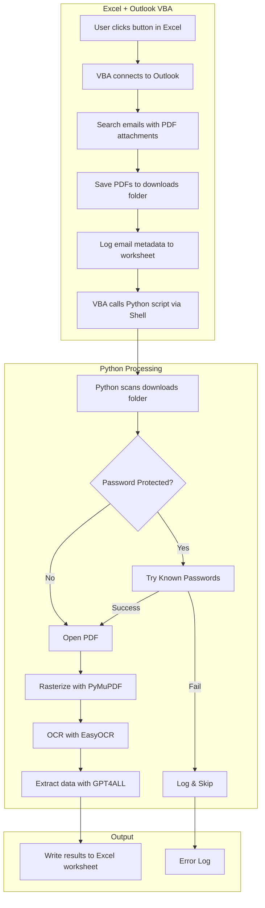
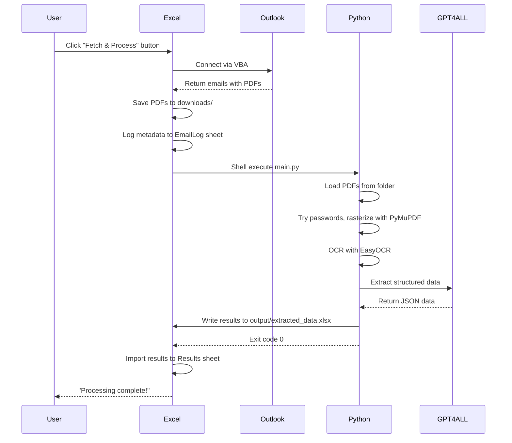

# PDF Email Extraction Pipeline (VBA + Python Hybrid)

## Architecture Overview



---

## Project Structure

```
project-worker/
├── PDFExtractor.xlsm       # Excel workbook with VBA macros
├── main.py                 # Python entry point
├── config.py               # Configuration (paths, prompts)
├── pdf_processor.py        # PDF decryption and rasterization
├── ocr_reader.py           # EasyOCR text extraction
├── data_extractor.py       # GPT4ALL structured data extraction
├── excel_writer.py         # Write results back to Excel
├── requirements.txt        # Python dependencies
├── passwords.txt           # List of known PDF passwords (one per line)
└── downloads/              # PDFs saved by VBA (auto-created)
```

---

## Module Design

### 1. VBA Module (in `PDFExtractor.xlsm`)

Add this code to a new VBA module in Excel:

```vba
Option Explicit

' Configuration - adjust these paths
Const DOWNLOAD_FOLDER As String = "C:\Users\rrr19\Documents\Codebases\Project-worker\downloads\"
Const PYTHON_PATH As String = "python"  ' Or full path to python.exe
Const SCRIPT_PATH As String = "C:\Users\rrr19\Documents\Codebases\Project-worker\main.py"

Sub FetchEmailsAndProcess()
    ' Main entry point - call from button
    Application.StatusBar = "Fetching emails from Outlook..."
    
    Dim pdfCount As Long
    pdfCount = SavePDFAttachments()
    
    If pdfCount > 0 Then
        Application.StatusBar = "Processing " & pdfCount & " PDFs with Python..."
        RunPythonScript
    Else
        MsgBox "No PDF attachments found.", vbInformation
    End If
    
    Application.StatusBar = False
End Sub

Function SavePDFAttachments() As Long
    ' Connect to Outlook and save PDF attachments
    Dim olApp As Object
    Dim olNs As Object
    Dim olFolder As Object
    Dim olMail As Object
    Dim olAttach As Object
    Dim savedCount As Long
    Dim ws As Worksheet
    Dim nextRow As Long
    
    ' Create downloads folder if needed
    If Dir(DOWNLOAD_FOLDER, vbDirectory) = "" Then
        MkDir DOWNLOAD_FOLDER
    End If
    
    ' Setup logging worksheet
    On Error Resume Next
    Set ws = ThisWorkbook.Sheets("EmailLog")
    If ws Is Nothing Then
        Set ws = ThisWorkbook.Sheets.Add
        ws.Name = "EmailLog"
        ws.Range("A1:E1").Value = Array("Timestamp", "Subject", "Sender", "Filename", "Status")
    End If
    On Error GoTo 0
    nextRow = ws.Cells(ws.Rows.Count, 1).End(xlUp).Row + 1
    
    ' Connect to Outlook
    Set olApp = CreateObject("Outlook.Application")
    Set olNs = olApp.GetNamespace("MAPI")
    Set olFolder = olNs.GetDefaultFolder(6)  ' 6 = Inbox
    
    savedCount = 0
    
    ' Loop through emails
    For Each olMail In olFolder.Items
        If TypeName(olMail) = "MailItem" Then
            For Each olAttach In olMail.Attachments
                If LCase(Right(olAttach.FileName, 4)) = ".pdf" Then
                    ' Save PDF to downloads folder
                    Dim savePath As String
                    savePath = DOWNLOAD_FOLDER & Format(Now, "yyyymmdd_hhnnss") & "_" & olAttach.FileName
                    olAttach.SaveAsFile savePath
                    
                    ' Log to worksheet
                    ws.Cells(nextRow, 1).Value = Now
                    ws.Cells(nextRow, 2).Value = Left(olMail.Subject, 100)
                    ws.Cells(nextRow, 3).Value = olMail.SenderEmailAddress
                    ws.Cells(nextRow, 4).Value = olAttach.FileName
                    ws.Cells(nextRow, 5).Value = "Downloaded"
                    nextRow = nextRow + 1
                    
                    savedCount = savedCount + 1
                End If
            Next olAttach
        End If
    Next olMail
    
    SavePDFAttachments = savedCount
End Function

Sub RunPythonScript()
    ' Execute Python script and wait for completion
    Dim wsh As Object
    Dim cmd As String
    Dim result As Long
    
    Set wsh = CreateObject("WScript.Shell")
    
    ' Build command with working directory
    cmd = "cmd /c cd /d """ & ThisWorkbook.Path & """ && " & _
          PYTHON_PATH & " """ & SCRIPT_PATH & """ """ & DOWNLOAD_FOLDER & """"
    
    ' Run and wait (0 = hidden window, True = wait)
    result = wsh.Run(cmd, 0, True)
    
    If result = 0 Then
        MsgBox "Processing complete! Check the Results sheet.", vbInformation
        ' Refresh results sheet
        RefreshResultsSheet
    Else
        MsgBox "Python script failed with exit code: " & result, vbExclamation
    End If
End Sub

Sub RefreshResultsSheet()
    ' Reload results from Excel file written by Python
    Dim resultsPath As String
    resultsPath = ThisWorkbook.Path & "\output\extracted_data.xlsx"
    
    If Dir(resultsPath) <> "" Then
        ' Copy results to this workbook
        Dim srcWb As Workbook
        Dim destWs As Worksheet
        
        Application.ScreenUpdating = False
        Set srcWb = Workbooks.Open(resultsPath, ReadOnly:=True)
        
        On Error Resume Next
        ThisWorkbook.Sheets("Results").Delete
        On Error GoTo 0
        
        srcWb.Sheets(1).Copy After:=ThisWorkbook.Sheets(ThisWorkbook.Sheets.Count)
        ActiveSheet.Name = "Results"
        srcWb.Close SaveChanges:=False
        Application.ScreenUpdating = True
    End If
End Sub
```

### 2. PDF Processor (`pdf_processor.py`)

Uses PyMuPDF (fitz) for decryption and rasterization:

```python
import fitz  # PyMuPDF
from pathlib import Path

def load_passwords(passwords_file: str) -> list[str]:
    """Load passwords from file, one per line."""
    path = Path(passwords_file)
    if not path.exists():
        return []
    return [line.strip() for line in path.read_text().splitlines() if line.strip()]

def try_open_pdf(pdf_path: str, passwords_list: list[str]) -> fitz.Document | None:
    """Attempt to open PDF, trying passwords if encrypted."""
    doc = fitz.open(pdf_path)
    if doc.is_encrypted:
        # Try empty password first
        if doc.authenticate(""):
            return doc
        for pwd in passwords_list:
            if doc.authenticate(pwd):
                return doc
        return None  # Failed to decrypt
    return doc

def rasterize_pages(doc: fitz.Document, dpi: int = 300) -> list[bytes]:
    """Convert PDF pages to PNG images for OCR."""
    images = []
    for page in doc:
        mat = fitz.Matrix(dpi / 72, dpi / 72)
        pix = page.get_pixmap(matrix=mat)
        images.append(pix.tobytes("png"))
    return images
```

### 3. OCR Reader (`ocr_reader.py`)

Uses EasyOCR for text extraction:

```python
import easyocr

# Initialize reader once (downloads model on first run)
_reader = None

def get_reader(languages: list[str] = ['en'], gpu: bool = True) -> easyocr.Reader:
    """Get or create EasyOCR reader instance."""
    global _reader
    if _reader is None:
        _reader = easyocr.Reader(languages, gpu=gpu)
    return _reader

def extract_text_from_images(images: list[bytes], languages: list[str] = ['en']) -> str:
    """Run OCR on rasterized PDF pages."""
    reader = get_reader(languages)
    full_text = []
    
    for img_bytes in images:
        # EasyOCR accepts bytes directly
        result = reader.readtext(img_bytes, detail=0)
        full_text.extend(result)
    
    return "\n".join(full_text)
```

### 4. Data Extractor (`data_extractor.py`)

Uses GPT4ALL for local LLM inference:

```python
import json
import re
from gpt4all import GPT4All

_model = None

def get_model(model_name: str = "Meta-Llama-3-8B-Instruct.Q4_0.gguf") -> GPT4All:
    """Get or create GPT4All model instance."""
    global _model
    if _model is None:
        _model = GPT4All(model_name)
    return _model

def extract_structured_data(text: str, extraction_prompt: str, model_name: str = None) -> dict:
    """Use LLM to extract specific fields from OCR text."""
    model = get_model(model_name) if model_name else get_model()
    
    prompt = f"""{extraction_prompt}

Document text:
---
{text[:4000]}  # Limit context length
---

Respond with ONLY valid JSON, no other text:"""

    response = model.generate(prompt, max_tokens=500, temp=0.1)
    return parse_json_response(response)

def parse_json_response(response: str) -> dict:
    """Extract JSON from LLM response."""
    # Try to find JSON in response
    try:
        # Look for JSON object pattern
        match = re.search(r'\{[^{}]*\}', response, re.DOTALL)
        if match:
            return json.loads(match.group())
    except json.JSONDecodeError:
        pass
    
    return {"raw_response": response, "parse_error": True}
```

### 5. Excel Writer (`excel_writer.py`)

```python
from openpyxl import Workbook
from pathlib import Path
from datetime import datetime

def write_to_excel(results: list[dict], output_path: str):
    """Write extracted data to Excel file."""
    output_path = Path(output_path)
    output_path.parent.mkdir(parents=True, exist_ok=True)
    
    wb = Workbook()
    ws = wb.active
    ws.title = "Extracted Data"
    
    if not results:
        ws.append(["No results"])
        wb.save(output_path)
        return
    
    # Get all unique keys for headers
    all_keys = []
    for r in results:
        for k in r.keys():
            if k not in all_keys:
                all_keys.append(k)
    
    # Write headers
    ws.append(all_keys)
    
    # Write data rows
    for result in results:
        row = [result.get(key, "") for key in all_keys]
        ws.append(row)
    
    # Auto-fit columns (approximate)
    for col in ws.columns:
        max_length = max(len(str(cell.value or "")) for cell in col)
        ws.column_dimensions[col[0].column_letter].width = min(max_length + 2, 50)
    
    wb.save(output_path)
    print(f"Results saved to: {output_path}")
```

### 6. Main Orchestrator (`main.py`)

```python
import sys
from pathlib import Path
from datetime import datetime

from config import PASSWORDS_FILE, OUTPUT_FILE, EXTRACTION_PROMPT, LLM_MODEL
from pdf_processor import try_open_pdf, rasterize_pages, load_passwords
from ocr_reader import extract_text_from_images
from data_extractor import extract_structured_data
from excel_writer import write_to_excel

def process_pdfs(downloads_folder: str) -> list[dict]:
    """Process all PDFs in the downloads folder."""
    downloads_path = Path(downloads_folder)
    passwords = load_passwords(PASSWORDS_FILE)
    results = []
    
    pdf_files = list(downloads_path.glob("*.pdf"))
    print(f"Found {len(pdf_files)} PDF files to process")
    
    for pdf_path in pdf_files:
        print(f"Processing: {pdf_path.name}")
        
        try:
            # Open PDF (with password if needed)
            doc = try_open_pdf(str(pdf_path), passwords)
            if doc is None:
                print(f"  ERROR: Could not decrypt {pdf_path.name}")
                results.append({
                    "filename": pdf_path.name,
                    "status": "FAILED - Password protected",
                    "processed_at": datetime.now().isoformat()
                })
                continue
            
            # Rasterize pages
            print(f"  Rasterizing {len(doc)} pages...")
            images = rasterize_pages(doc)
            doc.close()
            
            # OCR
            print(f"  Running OCR...")
            text = extract_text_from_images(images)
            
            # Extract data with LLM
            print(f"  Extracting data with LLM...")
            data = extract_structured_data(text, EXTRACTION_PROMPT, LLM_MODEL)
            
            results.append({
                "filename": pdf_path.name,
                "status": "SUCCESS",
                "processed_at": datetime.now().isoformat(),
                "ocr_text_length": len(text),
                **data
            })
            
            # Optionally move processed file
            # pdf_path.rename(downloads_path / "processed" / pdf_path.name)
            
        except Exception as e:
            print(f"  ERROR: {e}")
            results.append({
                "filename": pdf_path.name,
                "status": f"ERROR - {str(e)}",
                "processed_at": datetime.now().isoformat()
            })
    
    return results

def main():
    # Get downloads folder from command line or use default
    if len(sys.argv) > 1:
        downloads_folder = sys.argv[1]
    else:
        downloads_folder = Path(__file__).parent / "downloads"
    
    print(f"Processing PDFs from: {downloads_folder}")
    
    results = process_pdfs(downloads_folder)
    write_to_excel(results, OUTPUT_FILE)
    
    print(f"\nDone! Processed {len(results)} files.")
    return 0

if __name__ == "__main__":
    sys.exit(main())
```

---

## Configuration (`config.py`)

```python
from pathlib import Path

# Paths (relative to script location)
BASE_DIR = Path(__file__).parent
PASSWORDS_FILE = BASE_DIR / "passwords.txt"
OUTPUT_FILE = BASE_DIR / "output" / "extracted_data.xlsx"
DOWNLOADS_FOLDER = BASE_DIR / "downloads"

# OCR settings
OCR_LANGUAGES = ['en']
PDF_DPI = 300

# GPT4ALL model (will download on first run if not present)
LLM_MODEL = "Meta-Llama-3-8B-Instruct.Q4_0.gguf"

# Extraction prompt - CUSTOMIZE THIS for your documents
EXTRACTION_PROMPT = """
Extract the following fields from this document:
- Invoice Number
- Date
- Total Amount
- Vendor Name
- Due Date (if present)

Return as JSON with keys: invoice_number, date, total_amount, vendor_name, due_date
If a field is not found, use null.
"""
```

---

## Dependencies (`requirements.txt`)

```
PyMuPDF>=1.23.0
easyocr>=1.7.0
gpt4all>=2.0.0
openpyxl>=3.1.0
Pillow>=10.0.0
```

---

## Setup Instructions

1. **Create the Excel workbook:**
   - Create new Excel file, save as `PDFExtractor.xlsm` (macro-enabled)
   - Press `Alt+F11` to open VBA editor
   - Insert > Module, paste the VBA code
   - Adjust the `DOWNLOAD_FOLDER`, `PYTHON_PATH`, and `SCRIPT_PATH` constants

2. **Install Python dependencies:**
   ```
   pip install PyMuPDF easyocr gpt4all openpyxl Pillow
   ```

3. **First run of GPT4ALL:**
   - The model will download automatically (~4GB for Llama 3 8B)
   - Or pre-download from GPT4ALL website

4. **Add a button to Excel:**
   - Developer tab > Insert > Button
   - Assign macro: `FetchEmailsAndProcess`

5. **Configure passwords.txt:**
   - Add known PDF passwords, one per line

---

## Workflow



---

## Key Considerations

| Concern | Solution |
|---------|----------|
| Outlook permissions | User may need to click "Allow" for programmatic access |
| Password-protected PDFs | Tries all passwords from passwords.txt sequentially |
| Large PDFs | Processes page-by-page; consider lowering DPI for very large docs |
| LLM accuracy | Use explicit JSON format instructions; tune the prompt for your docs |
| Error handling | Errors logged to both console and Excel Results sheet |
| First run | EasyOCR and GPT4ALL will download models (~4-5GB total) |

---

## Implementation Todos

- [ ] Create project structure and requirements.txt
- [ ] Create VBA module in Excel to fetch emails from Outlook and save PDF attachments
- [ ] Implement pdf_processor.py with password handling and rasterization
- [ ] Implement ocr_reader.py with EasyOCR integration
- [ ] Implement data_extractor.py with GPT4ALL
- [ ] Implement excel_writer.py to write results back to the workbook
- [ ] Implement main.py to process PDFs from the download folder
- [ ] Add VBA button/macro to trigger Python script via Shell
